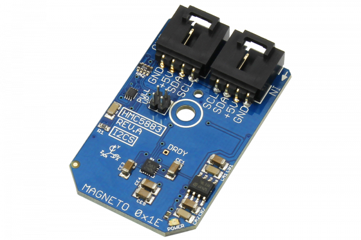

[](https://store.ncd.io/product/hmc5883-3-axis-digital-compass-12-bit-i2c-mini-module/).

# HMC5883

The HMC5883 is a digital compass designed for low-field magnetic sensing.This device has a wide magnetic field range of +/-8 Oe, and an output rate of 160 Hz.The HMC5883 sensor includes automatic degaussing strap drivers, offset cancellation, and a 12-bit ADC that enables 1° to 2° compass heading accuracy.
This Device is available from www.ncd.io

[SKU: HMC5883]

(https://store.ncd.io/product/hmc5883-3-axis-digital-compass-12-bit-i2c-mini-module/)
This Sample code can be used with Raspberry Pi.

Hardware needed to interface HMC5883 3Axis compass sensor With Raspberry Pi :

1. <a href="https://store.ncd.io/product/hmc5883-3-axis-digital-compass-12-bit-i2c-mini-module/">HMC5883 3Axis compass sensor</a>

2. <a href="https://store.ncd.io/product/i2c-shield-for-raspberry-pi-3-pi2-with-outward-facing-i2c-port-terminates-over-hdmi-port/">Raspberry Pi I2C Shield</a>

3. <a href="https://store.ncd.io/product/i%C2%B2c-cable/">I2C Cable</a>

## Python

Download and install smbus library on Raspberry pi. Steps to install smbus are provided at:

https://pypi.python.org/pypi/smbus-cffi/0.5.1

Download (or git pull) the code in pi. Run the program.

```cpp
$> python HMC5883.py
```
The lib is a sample library, you will need to calibrate the sensor according to your application requirement.
